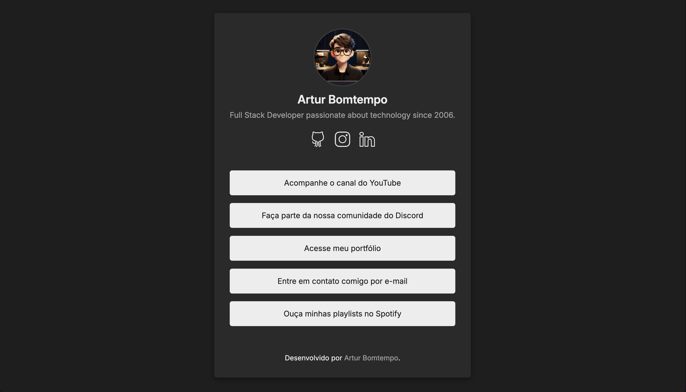

<div  align="center" id="about">
    <h1 align="center">
        Link in Bio
    </h1>
    <p align="center">
        Este projeto foi desenvolvido com o objetivo de ensinar os conceitos básicos de TypeScript, React e Styled Components de forma prática e didática. Criado para um tutorial no YouTube, ele demonstra o passo a passo para construir um Link in Bio, uma página que centraliza e facilita o acesso a diversos links importantes, como portfólio, redes sociais e contato. Inspirado em ferramentas como Linktree, este projeto oferece uma solução personalizável e acessível para quem deseja criar sua própria página de links, especialmente para o Instagram.
    </p>
    
</div>
<br>
<div align="center">
    <a href="https://github.com/reactjs" target="_blank">
        
    </a>
    <a href="https://github.com/arturbomtempo-dev/Link-in-bio-react-youtube-tutorial" target="_blank">
        
    </a>
    <a href="https://arturbomtempo-links.vercel.app/" target="_blank">
        
    </a>
    <a href="https://github.com/arturbomtempo-dev/Link-in-bio-react-youtube-tutorial/blob/main/LICENSE.md" target="_blank">
        
    </a>
</div>

---

<div align="center">
    <p>🇬🇧 <a href="https://github.com/arturbomtempo-dev/Link-in-bio-react-youtube-tutorial/blob/main/README.en.md" target="_blank"><strong>English version available here</strong></a></p>
</div>

<br>

<div id="table-of-contents"></div>

## 📋 Tabela de conteúdos

- [Sobre](#about)
- [Tabela de conteúdos](#table-of-contents)
- [Funcionalidades](#features)
- [Demonstração da aplicação](#application-demonstration)
- [Configuração e Execução da Aplicação](#setup-and-run-the-application)
- [Tecnologias](#technologies)
- [Autor](#author)
- [Licença](#license)

<div id="features"></div>

## 📝 Funcionalidades

- [x] Exibição de perfil com foto, nome e descrição
- [x] Adição de múltiplos links personalizados
- [x] Ícones de redes sociais com links diretos
- [x] Design responsivo para dispositivos móveis

<div id="application-demonstration"></div>

## 📲 Demonstração da aplicação


O projeto foi hospedado na Vercel e pode ser acessado diretamente clicando [aqui](https://arturbomtempo-links.vercel.app/).

<div id="setup-and-run-the-application"></div>

## 📁 Configuração e Execução da Aplicação

### ⚙️ Pré-requisitos

Antes de começar, você precisa ter as seguintes ferramentas instaladas na sua máquina: [Git](https://git-scm.com) e [Node.js](https://nodejs.org/).

Também é recomendável utilizar um editor de código como o [Visual Studio Code](https://code.visualstudio.com/).

### 🚀 Como Rodar a Aplicação Localmente

```bash
# Clone este repositório
$ git clone https://github.com/arturbomtempo-dev/Link-in-bio-react-youtube-tutorial.git

# Acesse a pasta do projeto
$ cd Link-in-bio-react-youtube-tutorial

# Instale as dependências
$ npm install

# Execute a aplicação em modo de desenvolvimento
$ npm run dev

# O front-end será iniciado na porta 5173 - acesse <http://localhost:5173>
```

<div id="technologies"></div>

## 💻 Tecnologias

As seguintes ferramentas e frameworks foram usados no desenvolvimento deste projeto:

- [**React.js:**](https://react.dev/learn): Uma biblioteca JavaScript popular para a construção de interfaces de usuário interativas e baseadas em componentes.
- [**TypeScript**](https://www.typescriptlang.org/docs): Uma linguagem de programação fortemente tipada que é baseada em JavaScript, adicionando tipos estáticos e melhorando a qualidade do código.
- [**Styled Components**](https://styled-components.com/docs): Uma biblioteca para estilização de componentes em React, permitindo a criação de CSS em JS de forma dinâmica e escopada.
- [**Vite**](https://vite.dev/guide/): Ferramenta de build rápida para React.js, oferecendo recarga instantânea e otimização para produção, melhorando a experiência de desenvolvimento.

<div id="author"></div>

## 👨🏻‍💻 Autor

---

| [<br><sub>Artur Bomtempo</sub>](https://arturbomtempo.dev/) |
| :--------------------------------------------------------------------------------------------------------------------------------------------------: |

Desenvolvido por Artur Bomtempo 👋🏻. Entre em contato:

[](mailto:arturbcolen@gmail.com)
[](https://www.linkedin.com/in/artur-bomtempo/)
[](https://www.instagram.com/arturbomtempo.dev/)

<div id="license"></div>

## 📜 Licença

Copyright (c) 2025 Artur Bomtempo Colen

Por meio deste, é concedida permissão, gratuitamente, a qualquer pessoa que obtenha uma cópia
deste software e dos arquivos de documentação associados (o "Software"), para tratar
no Software sem restrição, incluindo, sem limitação, os direitos
de usar, copiar, modificar, mesclar, publicar, distribuir, sublicenciar e/ou vender
cópias do Software, e permitir que pessoas a quem o Software seja fornecido o façam, sujeito às seguintes condições:

O aviso de copyright acima e este aviso de permissão devem ser incluídos em todas
as cópias ou porções substanciais do Software.

O SOFTWARE É FORNECIDO "COMO ESTÁ", SEM GARANTIA DE QUALQUER NATUREZA, EXPRESSA OU
IMPLÍCITA, INCLUINDO, MAS NÃO SE LIMITANDO ÀS GARANTIAS DE COMERCIALIZAÇÃO,
ADEQUAÇÃO A UM FIM ESPECÍFICO E NÃO INFRAÇÃO. EM NENHUM CASO OS
AUTORES OU TITULARES DOS DIREITOS AUTORAIS SERÃO RESPONSÁVEIS POR QUALQUER RECLAMAÇÃO, DANOS OU OUTRAS
RESPONSABILIDADES, SEJA EM UMA AÇÃO DE CONTRATO, AGRAVO OU DE OUTRA FORMA, DECORRENTES DE,
OU EM CONEXÃO COM O SOFTWARE OU O USO OU OUTRAS NEGOCIAÇÕES NO
SOFTWARE.
